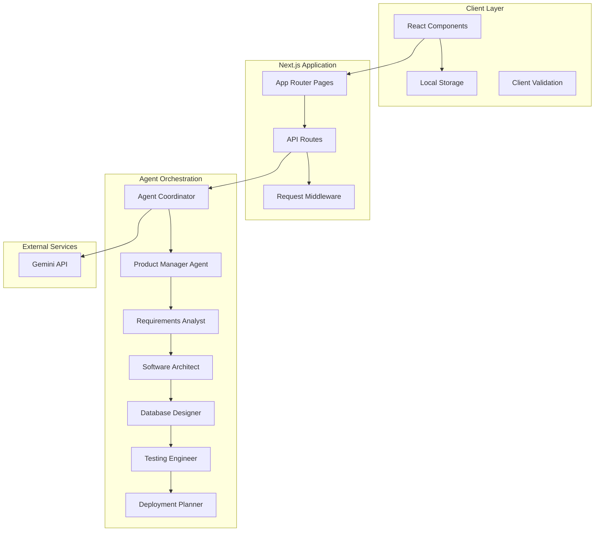
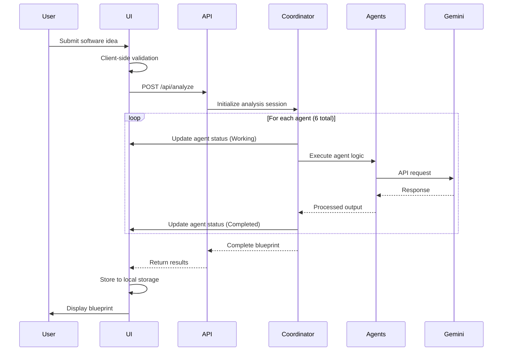

# Design Document - DevCrew AI

## Overview

DevCrew AI is a multi-agent software planning web application that transforms user software ideas into comprehensive development blueprints. The system coordinates six specialized AI agents in a sequential workflow, providing real-time status monitoring and generating structured development plans.

The application serves as an intelligent planning assistant for students and beginner developers, offering expert-level guidance across product management, requirements analysis, architecture design, database planning, testing strategy, and deployment planning.

### Key Design Principles

- **Multi-Agent Orchestration**: Sequential coordination of specialized AI agents for comprehensive coverage
- **Real-Time Monitoring**: Live status updates throughout the analysis process
- **Client-Side Persistence**: Local storage for project history without external dependencies
- **Security-First API Integration**: Server-side only API calls with credential protection
- **Responsive Accessibility**: Mobile-first design with full accessibility compliance
- **Error Resilience**: Graceful failure handling with clear user feedback

## Architecture

### System Architecture



### Request Flow Architecture



## Components and Interfaces

### Core React Components

#### 1. Main Application Shell
```typescript
interface AppShellProps {
  children: React.ReactNode;
}

// Provides navigation, theme context, and error boundaries
const AppShell: React.FC<AppShellProps>
```

#### 2. Software Idea Input Form
```typescript
interface SoftwareIdeaForm {
  onSubmit: (data: AnalysisRequest) => Promise<void>;
  isLoading: boolean;
  examples: string[];
}

interface AnalysisRequest {
  softwareIdea: string;
  productType: ProductType;
  complexityLevel: 'Prototype' | 'MVP';
}

type ProductType = 'Web Application' | 'Mobile App' | 'Desktop Application' | 'API Service' | 'E-commerce Platform';
```

#### 3. Agent Status Monitor
```typescript
interface AgentStatusMonitorProps {
  agents: AgentStatus[];
  currentAgent: number;
}

interface AgentStatus {
  name: string;
  status: 'Waiting' | 'Working' | 'Completed' | 'Failed';
  startTime?: Date;
  completionTime?: Date;
  error?: string;
}

const AGENT_SEQUENCE = [
  'Product Manager',
  'Requirements Analyst', 
  'Software Architect',
  'Database Designer',
  'Testing Engineer',
  'Deployment Planner'
] as const;
```

#### 4. Blueprint Viewer
```typescript
interface BlueprintViewerProps {
  blueprint: Blueprint;
  onDownload: () => void;
}

interface Blueprint {
  id: string;
  softwareIdea: string;
  productType: ProductType;
  complexityLevel: string;
  createdAt: Date;
  sections: BlueprintSection[];
}

interface BlueprintSection {
  agent: string;
  title: string;
  content: string;
  keyPoints: string[];
}
```

#### 5. Project History Manager
```typescript
interface ProjectHistoryProps {
  projects: ProjectSummary[];
  onSelectProject: (id: string) => void;
  onClearHistory: () => void;
}

interface ProjectSummary {
  id: string;
  title: string;
  productType: ProductType;
  complexityLevel: string;
  createdAt: Date;
  preview: string;
}
```

### API Route Interfaces

#### Analysis Endpoint
```typescript
// POST /api/analyze
interface AnalyzeRequest {
  softwareIdea: string;
  productType: ProductType;
  complexityLevel: 'Prototype' | 'MVP';
}

interface AnalyzeResponse {
  success: boolean;
  blueprint?: Blueprint;
  error?: string;
  agentStatuses: AgentStatus[];
}
```

#### Agent Processing
```typescript
interface AgentContext {
  softwareIdea: string;
  productType: ProductType;
  complexityLevel: string;
  previousOutputs: Record<string, string>;
}

interface AgentResponse {
  success: boolean;
  output: string;
  keyPoints: string[];
  error?: string;
}
```

### Local Storage Schema

```typescript
interface LocalStorageSchema {
  projects: StoredProject[];
  settings: UserSettings;
}

interface StoredProject {
  id: string;
  softwareIdea: string;
  productType: ProductType;
  complexityLevel: string;
  blueprint: Blueprint;
  createdAt: string; // ISO string
}

interface UserSettings {
  theme: 'light' | 'dark' | 'system';
  maxStoredProjects: number;
}
```

## Data Models

### Agent Configuration
```typescript
interface AgentConfig {
  name: string;
  role: string;
  systemPrompt: string;
  outputFormat: 'markdown' | 'structured';
  requiredInputs: string[];
  maxTokens: number;
  temperature: number;
}

const AGENT_CONFIGS: Record<string, AgentConfig> = {
  productManager: {
    name: 'Product Manager',
    role: 'Define product vision and user stories',
    systemPrompt: 'You are an expert product manager...',
    outputFormat: 'structured',
    requiredInputs: ['softwareIdea', 'productType', 'complexityLevel'],
    maxTokens: 2000,
    temperature: 0.7
  },
  // ... other agents
};
```

### Error Handling Models
```typescript
interface APIError {
  code: string;
  message: string;
  details?: Record<string, unknown>;
  retryable: boolean;
}

interface ValidationError {
  field: string;
  message: string;
  value: unknown;
}
```

### Blueprint Generation Pipeline
```typescript
interface AnalysisSession {
  id: string;
  request: AnalysisRequest;
  startTime: Date;
  currentAgent: number;
  agentOutputs: Record<string, AgentResponse>;
  status: 'running' | 'completed' | 'failed';
  error?: APIError;
}
```

## Error Handling

### Client-Side Error Handling

#### Form Validation
```typescript
const validateSoftwareIdea = (idea: string): ValidationError[] => {
  const errors: ValidationError[] = [];
  
  if (!idea.trim()) {
    errors.push({
      field: 'softwareIdea',
      message: 'Software idea is required',
      value: idea
    });
  }
  
  if (idea.length > 2000) {
    errors.push({
      field: 'softwareIdea', 
      message: 'Software idea must be under 2000 characters',
      value: idea
    });
  }
  
  return errors;
};
```

#### Error Boundary Implementation
```typescript
interface ErrorBoundaryState {
  hasError: boolean;
  error?: Error;
  errorInfo?: ErrorInfo;
}

class AnalysisErrorBoundary extends Component<PropsWithChildren, ErrorBoundaryState> {
  // Catches and displays agent processing errors
  // Provides retry mechanisms for recoverable failures
}
```

### Server-Side Error Handling

#### API Error Categories
- **Validation Errors** (400): Invalid input parameters
- **Authentication Errors** (401): Missing or invalid API keys
- **Rate Limit Errors** (429): Gemini API rate limiting
- **Service Errors** (500): Agent processing failures
- **Timeout Errors** (504): Long-running agent timeouts

#### Retry Logic
```typescript
interface RetryConfig {
  maxAttempts: number;
  baseDelay: number;
  maxDelay: number;
  backoffFactor: number;
}

const geminiRetryConfig: RetryConfig = {
  maxAttempts: 3,
  baseDelay: 1000,
  maxDelay: 10000,
  backoffFactor: 2
};
```

#### Error Recovery Strategies
- **Agent Failure**: Resume from failed agent with context preservation
- **API Timeout**: Implement exponential backoff with jitter
- **Rate Limiting**: Queue requests with intelligent throttling
- **Network Errors**: Client-side retry with user feedback

## Testing Strategy

### Unit Testing Approach

The testing strategy focuses on component isolation, API validation, and error handling verification using Jest and React Testing Library.

#### Component Testing
- **Input Form Testing**: Validation logic, user interactions, error display
- **Agent Monitor Testing**: Status updates, progress visualization, error states
- **Blueprint Viewer Testing**: Content rendering, navigation, download functionality
- **Project History Testing**: Storage operations, project selection, data persistence

#### API Testing
- **Agent Orchestration**: Sequential processing, context passing, failure handling
- **Gemini Integration**: Request formatting, response parsing, error recovery
- **Local Storage**: Data persistence, retrieval, cleanup operations
- **Validation**: Input sanitization, schema compliance, boundary conditions

#### Error Scenario Testing
- **Network Failures**: Offline handling, connection recovery, user feedback
- **API Failures**: Rate limiting, timeout handling, graceful degradation
- **Storage Failures**: Quota exceeded, data corruption, fallback strategies
- **Agent Failures**: Individual agent errors, session recovery, user notification

### Integration Testing

#### End-to-End User Flows
1. **Complete Analysis Flow**: Idea input → agent processing → blueprint generation → download
2. **Project History Flow**: Save → retrieve → display previous analyses
3. **Error Recovery Flow**: Failure → retry → successful completion
4. **Mobile Experience Flow**: Responsive behavior across device sizes

#### API Integration Testing
- **Gemini API Integration**: Authentication, request/response handling, rate limiting
- **Agent Chain Testing**: Sequential processing with real API responses
- **Performance Testing**: Response times, memory usage, concurrent users

### Accessibility Testing

#### Automated Testing
- **axe-core Integration**: Automated WCAG compliance checking
- **Keyboard Navigation**: Tab order, focus management, screen reader compatibility
- **Color Contrast**: Text readability across light/dark themes
- **Semantic HTML**: Proper ARIA labels, heading hierarchy, form associations

#### Manual Testing Requirements
- **Screen Reader Testing**: VoiceOver, NVDA, JAWS compatibility
- **Keyboard-Only Navigation**: Complete functionality without mouse
- **High Contrast Mode**: Windows high contrast compatibility
- **Zoom Testing**: 200% zoom functionality preservation

### Performance Testing

#### Client-Side Performance
- **Bundle Size Analysis**: Code splitting effectiveness, lazy loading
- **Rendering Performance**: Component mount times, update efficiency
- **Memory Usage**: Local storage limits, cleanup strategies
- **Mobile Performance**: Touch interactions, viewport optimization

#### Server-Side Performance  
- **API Response Times**: Agent processing speed, timeout handling
- **Concurrent User Handling**: Rate limiting, resource management
- **Error Recovery Performance**: Retry mechanisms, failover speed

### Testing Tools and Configuration

```typescript
// Jest configuration for API testing
const jestConfig = {
  testEnvironment: 'node',
  setupFilesAfterEnv: ['<rootDir>/src/tests/setup.ts'],
  testMatch: ['**/__tests__/**/*.test.ts', '**/*.test.ts'],
  collectCoverageFrom: [
    'src/**/*.{ts,tsx}',
    '!src/**/*.d.ts',
    '!src/tests/**/*'
  ],
  coverageThreshold: {
    global: {
      branches: 80,
      functions: 80,
      lines: 80,
      statements: 80
    }
  }
};

// React Testing Library configuration  
const rtlConfig = {
  testIdAttribute: 'data-testid',
  defaultHidden: true,
  throwSuggestions: true
};

// Playwright configuration for E2E testing
const playwrightConfig = {
  testDir: './e2e',
  timeout: 30000,
  retries: 2,
  use: {
    actionTimeout: 10000,
    baseURL: 'http://localhost:3000',
    trace: 'on-first-retry'
  },
  projects: [
    { name: 'Desktop Chrome', use: { ...devices['Desktop Chrome'] } },
    { name: 'Mobile Safari', use: { ...devices['iPhone 12'] } },
    { name: 'Desktop Firefox', use: { ...devices['Desktop Firefox'] } }
  ]
};
```

This comprehensive testing strategy ensures the multi-agent system works reliably across all user scenarios while maintaining performance, accessibility, and error resilience standards.